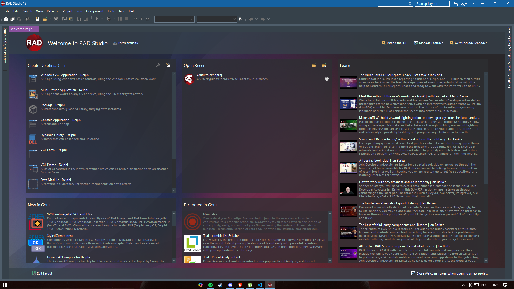

# Product Project - Desktop

### Esse projeto consiste na visualização, exclusão e inserção de produtos (não finalizado a parte de alteração) desenvvolvidos com delphi e um back-end em C#.

## Funcionalidades principais
- Visualização dos produtos cadastrados
- Exclusão dos produtos cadastrados
- Inserção de novos produtos

## Tecnologias utilizadas
- Delphi

### Instalação do Delphi
[Link para instalação do Delphi](https://www.embarcadero.com/br/products/delphi)

### Criação de um projeto novo
](image.png)

Clique em Windows VCL Application - Delphi e depois salve o arquivo em qualquer pasta de sua preferência.

### Inicialização do projeto

Ao clonar o repositório entrar na pasta Win32 - Debug - dar dois cliques no CrudProject